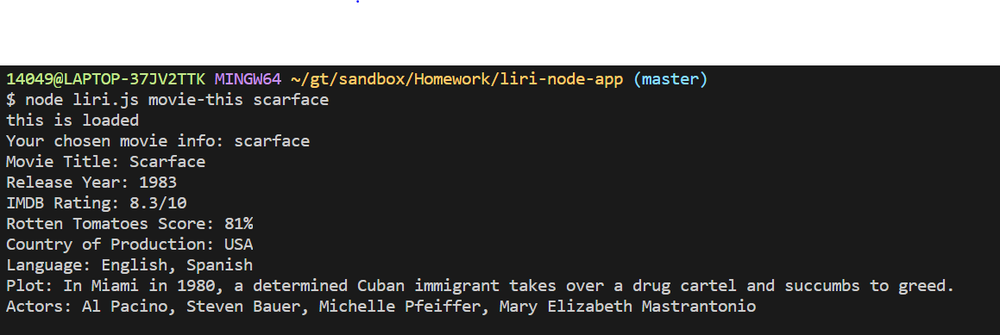

# liri-node-app

Overview
In this assignment, you will make LIRI. LIRI is like iPhone's SIRI. However, while SIRI is a Speech Interpretation and Recognition Interface, LIRI is a Language Interpretation and Recognition Interface. LIRI will be a command line node app that takes in parameters and gives you back data.

What Each Command Should Do

1. node liri.js movie-this + "movie name here"

   This will output the following information to your terminal/bash window:
   

2. node liri.js spotify-this-song + "song name here"

   This will output the following information to your terminal/bash window:
   

3. node liri.js concert-this + "band name here"

   This will output the following information to your terminal/bash window:
   

4) node liri.js do-what-it-says

   Using the fs Node package, LIRI will take the text inside of random.txt and then use it to call one of LIRI's commands.
   
